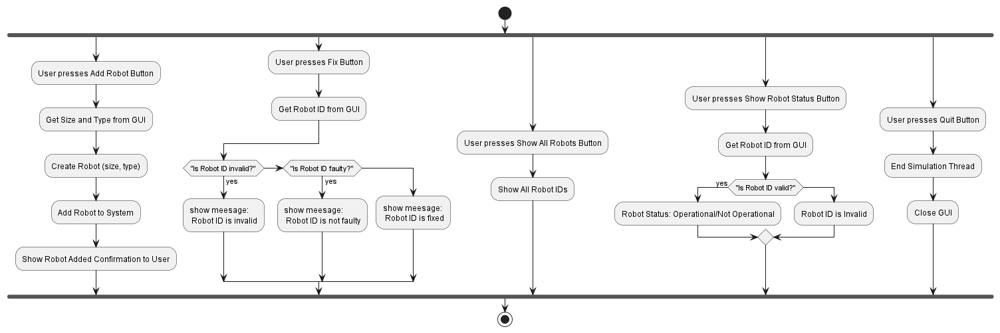

# Activity Diagrams

## Robot Database Simulation Activity Diagram
This activity diagram describes the process of interacting with a robot, simulation, and database system. It showcases how users can add robots with specific sizes and functions to the system and then store and process these robots within the simulation and database.

## Key Steps in the Diagram:
+ Start of the Process:

+ User chooses 1 of the 4 availible views based on their role:
   - The user initiates an action by clicking on 1 of these buttons that coresponds to their specific role.
   - The system then shows a specific view with certain availible actions based on the view that they choose. 
   - The "Quit" button here exits the whole programming, stopping the simulation.
   - For the actions listed below, the role in the parentheses dictates who can perform what action. 

+ User Presses Add Button (Building Manager):

   - The user initiates an action by pressing the Add Button.
   - The system proceeds to get the size and type for the robot from the GUI.
   - The robot is created based on the size and type selected by the user.
   - The newly created robot is added to the system.
   - A confirmation message is displayed, indicating that the robot has been successfully added to the system.
   - Closing the tab returns the user back to the selection page for the various roles.

+ User Presses Assign Button (Building Manager):
   - The user first enters an id into the GUI to identify which robot they want to refernce. 
   - The user then enters a room id into the GUI to identify which room they want to assign the robot to. 
   - The system then checks the validity of the room and robot id. If either id is not valid, the system returns a message displaying that the id is invalid and to enter another. 
   - If the id is valid, the system manager passes this room change to the simulation to be implemented and the database is updates accordingly. 
   - Closing the tab returns the user back to the selection page for the various roles.

+ User Presses Fix Button (Field Engineer):

   - The user presses the Fix Button.
   - The system gathers data (Robot ID) from GUI  to identify which robot they want to fix.
   - The system checks the robot's status based on the ID:
   - If the ID is invalid, a message is displayed saying that the robot ID is invalid.
   - If the ID is faulty, a message is shown indicating that the robot is faulty.
   - Otherwise, the robot's ID is marked as fixed, and a corresponding message is displayed.
   - Closing the tab returns the user back to the selection page for the various roles.

+ User Presses Show All Robots Button (Field Engineer):

   - The user presses the Show All Robots Button.
   - The system retrieves and displays all the robot IDs currently stored in the system.
   - Closing the tab returns the user back to the selection page for the various roles.

+ User Presses Show Robot Status Button (Building Staff, Field Engineer):

   - The user presses the Show Robot Status Button.
   - The system prompts the user to enter a robot ID to check its status.
   - The system checks whether the robot ID is valid:
   - If the ID is valid, it shows the robot’s status (whether it is Operational or Not Operational).
   - If the ID is invalid, the system will indicate that the robot ID is invalid.
   - Closing the tab returns the user back to the selection page for the various roles.

+ User Presses Refil Robot (Building Staff):
   - The user enters a robot id to reference an active robot.
   - If the ID is valid, the system will tell the simulation to set its washer levels to full. This information is also passed to the database.
   - If the ID is invalid, the system will indicate that the robot ID is invalid.

+ User Presses Quit Button (Anyone):

   - Finally, the user presses the Quit Button.
   - The system proceeds to end the simulation thread and close the GUI.

## Flow of the Diagram:
The diagram illustrates the flow of actions with parallel processes using fork and end fork constructs. Each action (pressing a button) creates its own flow, which can run along with other actions. 