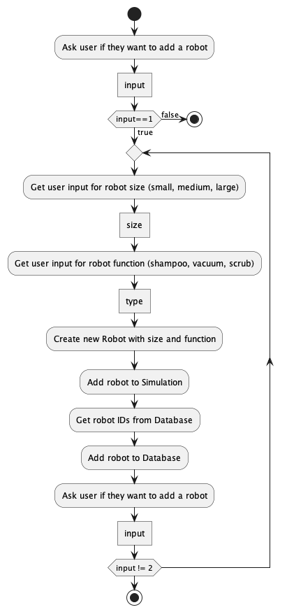

# Activity Diagrams

## Robot Database Simulation Activity Diagram
This activity diagram describes the process of interacting with a robot, simulation, and database system. It showcases how users can add robots with specific sizes and functions to the system and then store and process these robots within the simulation and database.

### Key Steps in the Diagram:
1. **Prompt User for Action**: The system starts by asking the user if they want to add a robot. The user is expected to provide an input.
   
2. **Decision Point - Add a Robot or Quit**: 
   - If the user input is 1, the system proceeds to the steps for adding a robot.
   - If the user input is 2, the system terminates (indicating that the user has chosen to quit).

3. **Robot Size Selection**: When the user opts to add a robot, the system displays size options (small, medium, or large) and waits for the user’s input to select one.

4. **Robot Function Selection**: After the size is selected, the system asks the user to choose a function for the robot (shampoo, vacuum, or scrub).

5. **Robot Creation**: With the chosen size and function, a new robot is created.

6. **Simulation and Database Interaction**:
   - The created robot is added to the ongoing simulation.
   - The system retrieves the robot’s ID from the database and then adds the robot to the database for tracking.

7. **Re-prompt User for Action**: After the robot is added, the system asks the user again whether they want to add another robot or quit. This leads to either repeating the process or terminating the program based on the input.

### Loop Structure:
- The loop continues as long as the user opts to add more robots. Once the user selects the option to quit, the process terminates.
