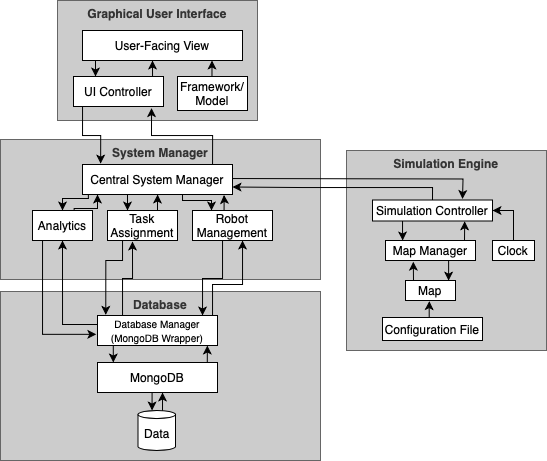

# Architecture

## Architecture Diagram:

There are 4 main components to the architecture:
- Graphical User Interface
- System Manager
- Simulation Engine
- Database

 ### Graphical User Interface
 The GUI will be made up of few components:
 - The Framework/Model is the static look and design of the GUI. There is no functionality attached to any of the buttons here
 - The UI Controller is the functionality behind the buttons and features in the framework/model
 - Together, the UI Controller and the Framework/model combine to create the User-Facing View, which is what the users interact with

 ### System Manager
 The system manager is doing the main "work" in the program.
 - The Central System Manager will act as a station controlling input/output from the UI as well as input to the simulation engine. It is also the top layer behind the different features the robots have, like analytics, task assignment, and robot management
 - The Analytics component will be responsible for getting data from the database and creating the statistics that will be displayed on the UI
 - The Task Assignment component is responsible for any time the user wants to give the robot a job to do, and how the priorities of jobs will be decided
 - The Robot Management keeps track of where the robots actually are and where they need to go at all times

 ### Database
 The Database is responsible for storing data and for queries of that data.
 - The Database Manager will be a MongoDB wrapper to have nice and easy calls to retrieve and manage data
 - The MongoDB entity just represents the MongoDB commands that are abstracted away by the Database Manager
 - The Data entity represents the raw data stored

 ### Simulation Engine
 The Simulation Engine mainly takes input from the system manager in order to simulate the robots cleaning and going to the correct locations.
 - The Simulation Controller will be the main component doing the work for the simulation engine.
 - The clock entity keeps track of the time and increments the clock ticks.
 - The Map manager is a wrapper for all operations done to the map (i.e. moving robots).
 - The Map is the graph with nodes for rooms and edges for hallways (connections between the rooms)
 - The Configuration File is just a simple JSON file for how the map will be set up
