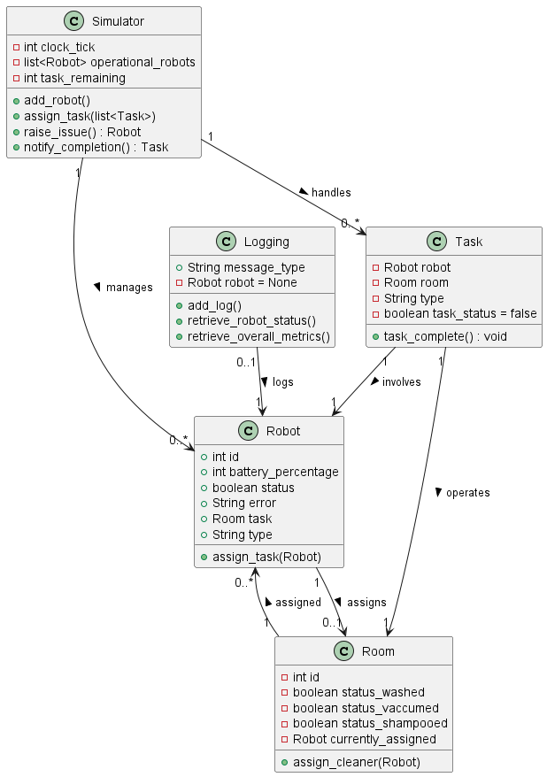

## Classes

We have created five major Classes. 

Robot consists of attributes like id, battery, status, type and so on. It also has an attribute Room which is only filled if a task is assigned to it. Thus, it has Association with Room. 

Room attribute is created from the map provided which has its own floor type and might have some further subclasses as the floor_type would change other attributes. It uses Robot for its method so has a dependency to it. 

Task is used by Robot and has both Room and Robot as its attribute and has a stronger coupling: Aggregation. Simulator also recieves Task before assigning it to Robots. The relationship there is dependency. 

Logging entity will help us to make the communication system easier. It has Robot as an attributes since a log is usually complemented by a Robot instance. It will primarily reside in our System Manager to make the interaction between Database on backend easier. 

Simulator will be the biggest of the classes which will continuously run. From assigning task to sending notification, it will all be done by Simulator. It has list of Robots as attribute and uses Task and by transitive property also uses Room. It has an Aggregation and Depedency with those classes respectively. 

