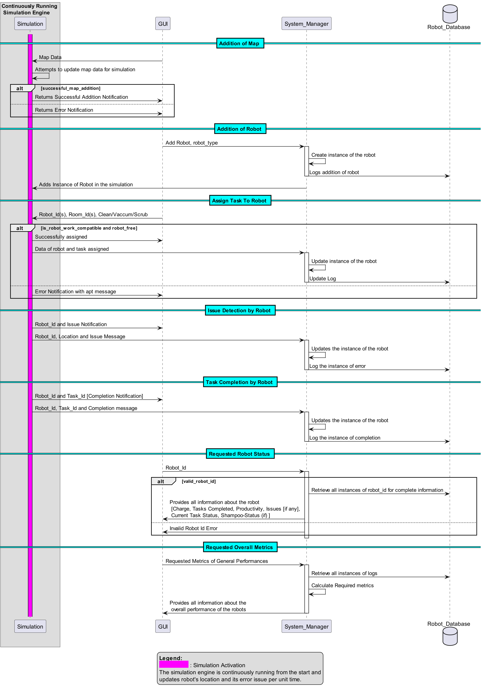

# This is your design document's top level!

This is where the core designs are started.
You will also store your PlantUML source files in this directory.

## Entity Sequence Diagram 

[ARCHITECTURE.md](Architecture/ARCHITECTURE.md)

[CLASSES.md](Classes/CLASSES.md)

