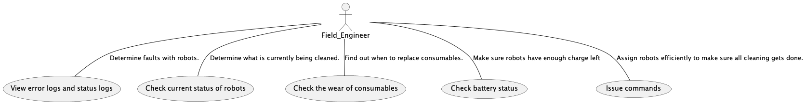

## Field Engineer Use Case Diagram ##

This diagrams shows the Field Enginner are their different use cases based on the user stories generated. Below is a basic description of the use cases. 

1. View error/status logs.
- As a field engineer, we need to be able to determine what went wrong with a robot if it fails and determine how to fix these issues. A key component that allows for this to happen is having the robots dump and the system give access to logs so the engineer can figure out the specific reason for the failure.

2. Check Status of the robots. 
- As a field engineer, we need to keep tabs on what each robot is doing at any given time. To do this, we have the UI interact with the simulation to report whats happening to the robots. 

3. Check the wear of consumables.
- As a field engineer, we'll have to replace things like fluids, brushes, and wheel bearings to ensure that the robots stay up and running. We can do this by having the UI interact with the simulation and database to determine the current wear, then report that to the Field Engineer. 

4. Check batter status.
- As a field engineer, we are partially responsible in making sure a cleaning task gets done. Cleaning tasks can't get done if the robots do not have enough battery. As such, we have the UI and simulation communicate and report the remaining battery life of a robot so we can sub them out if one gets close to running out of charge.

5. Issue commands.
- As a field engineer, we must be able to issue commands to do our job efficiently. As such we have the UI, system manager, and simulation communicate so we can issue commands. 