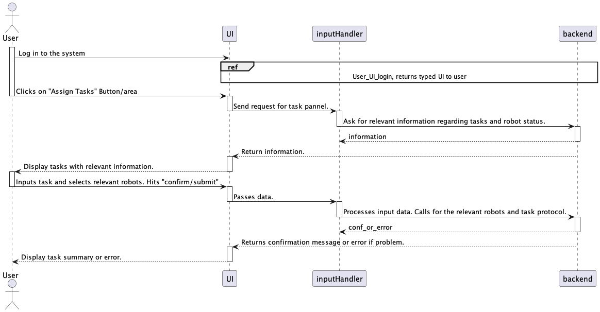
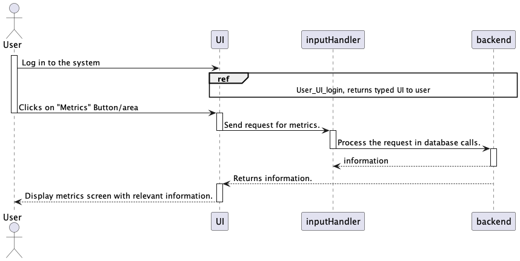
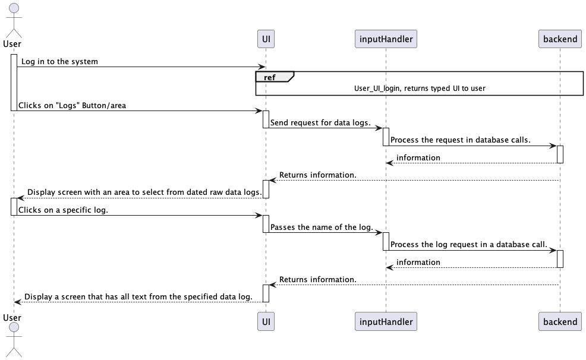
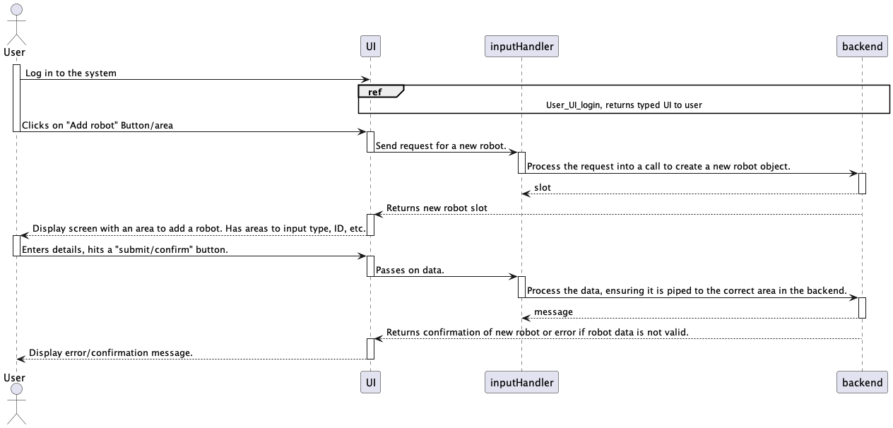
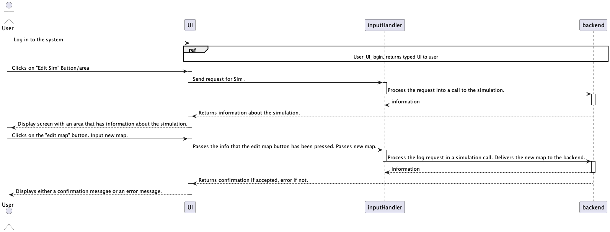
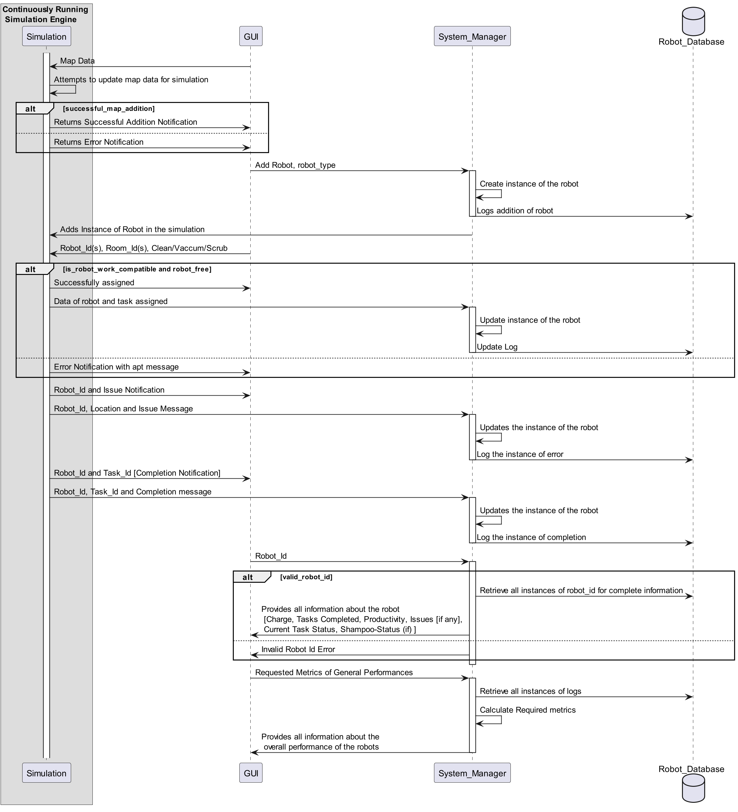

# Sequence Diagrams

## User to UI:
Each diagram describes an interaction between the User and the UI when accomplishing the following tasks. The Diagrams are broken up into those which can be done with both the technical view and simple view, and those that must be done with the technical view. 
 ### Assigning a task
 

 ### Getting Metrics
 

 ### Accessing Logs for maintenence/errors
 

 ### Adding/Viewing Status of Robots
 

 ### View/Edit the floor map
 

## Entity:

The Entity Sequence Diagram describes the flow of data in a normal simulation. 

Building Manager will initially input a role through the GUI that needs to be validated by Simulator. Once the map is in the repertoire, the simulator process the map, part of which is creating a room instance for each room. An appropirate message is sent back depending on the process. 

GUI allow addition of robot(s) which first goes through System Manager where the instance of robots are created. The data is logged into the database and the Simulator is also informed of it. 

The next step is to assign task to the robot(s). This will occur through the Task instance that can be referred in our Classes.md. Both the Simulator and the System Manager are sent this message for proper processing. 

Simulator is also responsible for detecting issues and sending notification of completion to the user through GUI. 

Some roles have access to the robot status and other roles have access to the overall metric of the tasks. This information is pulled from the database through communication via. System Manager. The information is ultimately sent to GUI for the users. 