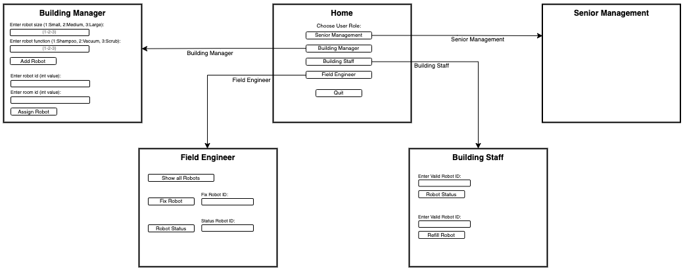

# User Interface

Here is what the intitial user interface should resemble:

**At a high level, we want to have a few different views depending on who is accessing the platform. We would rather the more technically inclined operators have access to a lot of the technical data, while keeping those in the C suite limited to a more basic, user friendly view.**

### C-suite/Senior Management and Building Manager 
- This view will be a more simplistic view. 
- Will still be able to issue commands and view the status of the robots. 
- Will be able to input and view maps. 
- See the status of current robots and where they are located in the map.

### Operator/Field-Engineer
- More technical view.
- All the base views of the managers.
- Give access to status/error logs directly. 
- Be able to override other commands given to robots
- Access to raw database. 

**When first logging in, the UI asks the user for their credentials. This helps determine whether to display the more technical display or the more user friendly display.**
- After logging in, we display one of the two views. 
- There are separate screens to zero in on each robot and to issue commands. 
- There is a preview of the simulation on the home screen which can be expanded.
- In the more technical vision, there is a direct access area for the error/status logs as well as an area to view the database. 
- Also present is an area to override the robots command with a different command (Only for Operator/Field-Engineer. 
