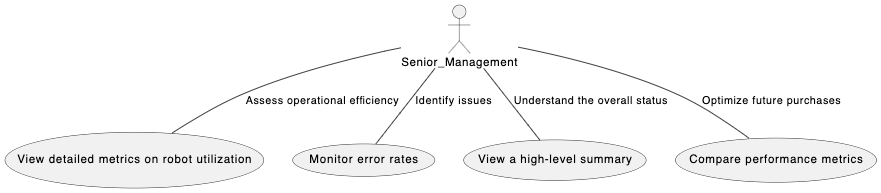
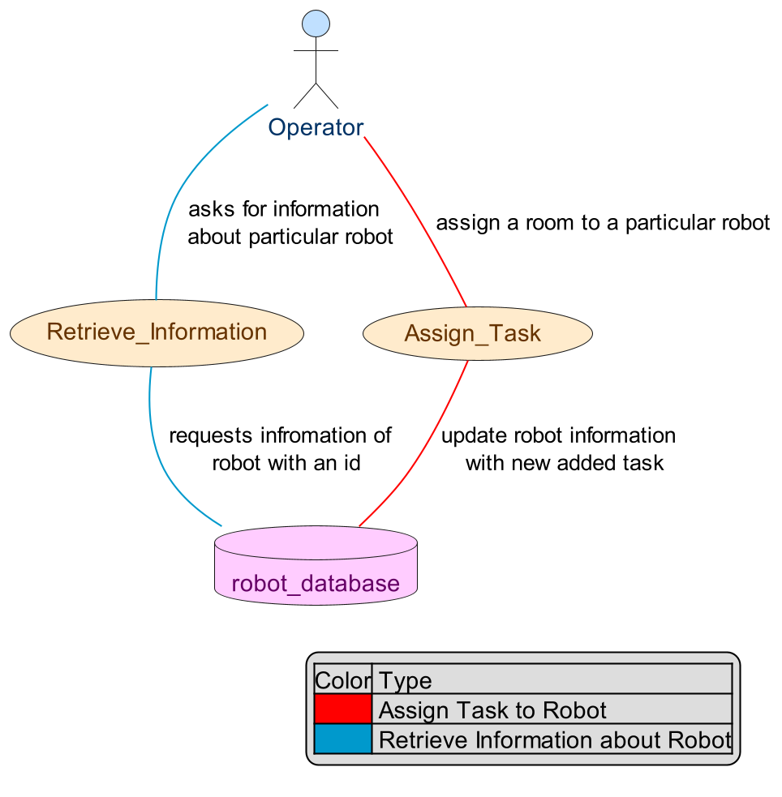

# Use Case Diagrams

## Senior Management Use Case Diagram

This diagram shows the Senior Management user and different use cases based off their user stories. All these use cases will be the user intereacting with the user interface to achieve what they want. 

## Building Staff (Operator) Use Case Manager

This diagram depicts role and activities of Operator. There are two major actions: Retrieve Information and Assign Task. Operator mostly retrieve information about robot, their status, errors and log data which is facilitated through the use of database. The Operator also assigns task to the robot which is logged into the database. 