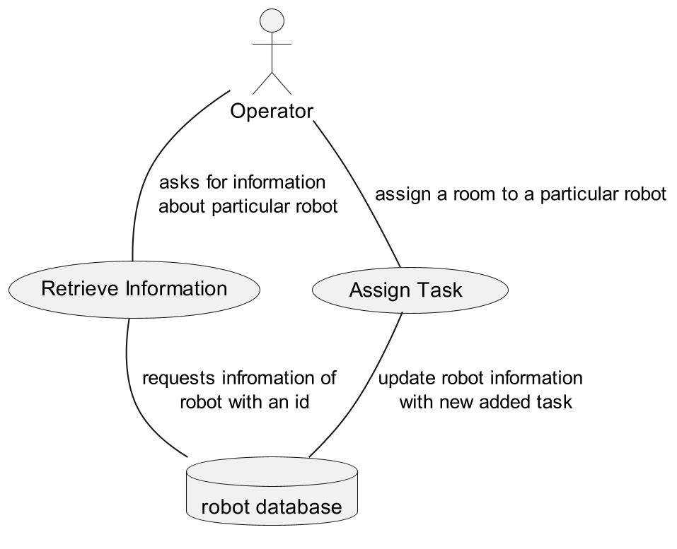

# Use Case Diagrams

## Building Manager Use Case Diagram

Hello

## Field Engineer Use Case Diagram 

This diagram shows the Field Engineer and their different use cases based on the user stories generated. The 5 use cases are view error/status logs, check status of the robots, check the wear of consumables, check battery status, and issue commands.

## Building Staff (Operator) Use Case Diagram

This diagram depicts role and activities of Operator. There are two major actions: Retrieve Information and Assign Task. Operator mostly retrieve information about robot, their status, errors and log data which is facilitated through the use of database. The Operator also assigns task to the robot which is logged into the database. 

## Senior Management Use Case Diagram

This diagram shows the Senior Management user and different use cases based off their user stories. All these use cases will be the user intereacting with the user interface to achieve what they want. 
