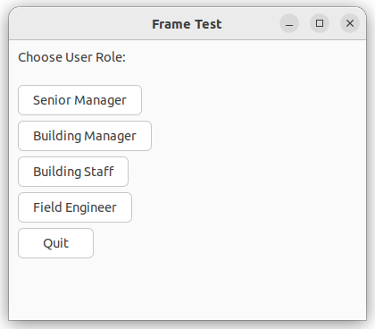
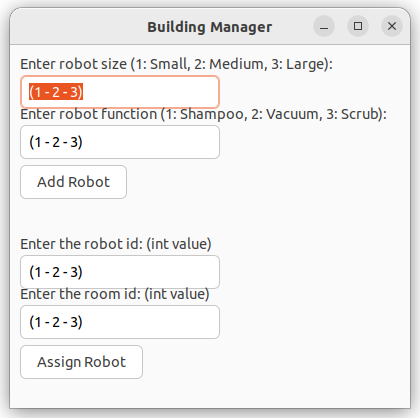
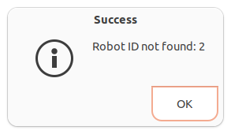
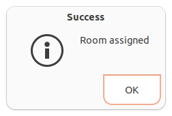
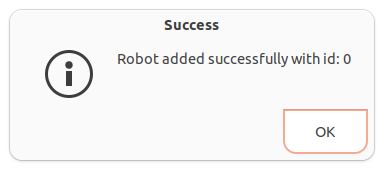
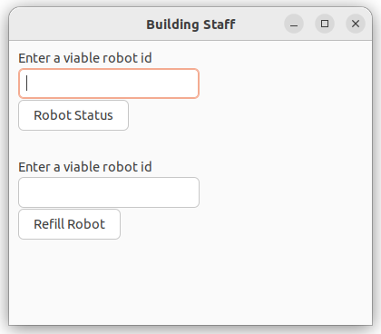
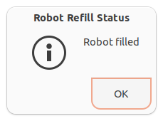
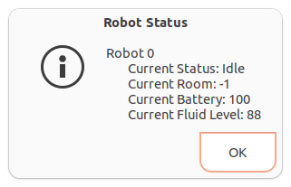
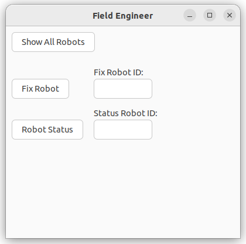

# User Guide for Robot Database Simulation

## Running the System
To start up the system, follow these steps:
1. Make sure you are in the main-project-jeck-inc directory
2. Build the directory
3. Run main

**Note:** The user will need to dowloand MongoDB Compass Shell and GUI for the database calls to work correctly.

## Tests
Example tests can be found in the [tests directory](../../tests)

## Guide to Interact with GUI
The following guide explains how to interact with the Robot Database Simulation system using the GUI. At the beginning you will face the home page where one has the option to choose from one of the four roles: Senior Manager, Building Manager, Building Staff and Field Engineer.

### Senior Manager
This role is still under work and will be completed in the next sprint. 

### Building Manager
Building Manager will have the ability to add a robot and assign task to robot. Upon pressing one of those buttons, an appropriate message will pop up. Either a success or an error (for instance, invalid robot id.).

### Building Staff
Building Staff will have the ability to check the robot status or do a maintenance update by filling it with shampoo or whatever necessary items it requires. 

### Field Engineer
Field Engineer can see all the robots in the simulation, fix a robot if it is broken and/or see the robot status of a particular robot like a Building Staff.

